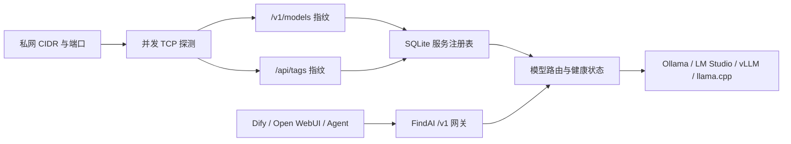

# FindAI

FindAI 是一个面向家庭、工作室和小型机房的“局域网模型服务发现 + 注册表 + OpenAI 兼容网关”。它会扫描指定私网网段和端口，读取模型服务的公开指纹，将发现结果持久化，然后用一个稳定的 `/v1` 地址向 Dify、Open WebUI、LibreChat、LangChain 等上层系统提供模型。

当前版本是可运行的 MVP，重点解决三个问题：不知道局域网里有哪些模型服务、每个业务系统都要重复配置地址、同名模型和节点上下线难以管理。

## 实现思路

局域网模型服务目前没有被普遍采用的标准发现协议。mDNS/SSDP 可以作为后续的加速机制，但无法指望 Ollama、LM Studio、vLLM、llama.cpp 等现有部署都主动广播统一服务类型。因此首版采用确定性更高的主动发现：

1. 从配置或本机地址推断私网 CIDR；未提供掩码时保守推断为 `/24`。
2. 并发检查常见端口及用户指定端口，先进行短超时 TCP 探测。
3. 对开放端口请求 `GET /v1/models`，校验是否返回 OpenAI 风格的 `object/data/id` 模型清单。
4. 对不匹配的端口再检查 Ollama 原生 `GET /api/tags`。
5. 将节点、模型、延迟、鉴权状态和最后在线时间写入 SQLite。
6. 将模型发布为 `<服务ID>::<上游模型名>`，避免多个节点的同名模型冲突；请求也可以直接使用唯一的原始模型名。
7. `/v1/*` 请求按模型路由到在线节点。普通 JSON 原样转发，SSE 不缓冲透传；旧版 Ollama 的 `/api/chat` 会转换为 Chat Completions 格式。



OpenAI 官方 OpenAPI 规范将模型清单定义为 `GET /v1/models`，响应主体为 `object: list` 与 `data[]`；Chat Completions 使用 `POST /v1/chat/completions`，流式响应媒体类型为 `text/event-stream`。FindAI 使用这两个约定作为兼容性锚点，而不是仅凭端口号猜测服务。参考：[List models](https://developers.openai.com/api/reference/resources/models/methods/list)、[Chat Completions](https://developers.openai.com/api/reference/chat-completions/overview)、[OpenAI models](https://developers.openai.com/api/docs/models)。官方文档也建议新建的 OpenAI 原生项目优先考虑 Responses API；FindAI 仍以 Chat Completions 为首要兼容面，是因为当前局域网推理服务器对它的支持最广。

## 已实现能力

- 自动推断本机私网 `/24`，也可明确指定多个 CIDR。
- 常见推理端口扫描、自定义端口和小范围端口段。
- OpenAI 兼容服务、需要 Bearer Key 的兼容服务、原生 Ollama 识别。
- 周期扫描、手工补录、节点复检、在线/离线状态和 SQLite 持久化。
- 聚合 `GET /v1/models`，使用稳定路由模型 ID。
- 通用 JSON `POST /v1/*` 模型路由，因此可转发 Chat Completions、Embeddings、Completions 和上游已实现的 Responses 等接口。
- Chat Completions SSE 流式透传。
- 原生 Ollama `/api/chat` 到 OpenAI Chat Completions 的非流式与流式适配。
- 上游 Key 可通过环境变量提供，或在网页中临时加载到进程内存；网页不会回显 Key。
- 私网目标校验、最大扫描主机数、并发数和短连接超时限制。
- 自带中文管理控制台和 FastAPI `/docs` 接口文档。

## Windows PowerShell 启动

程序会自动读取启动目录中的 `.env`，仓库已经提供一份适合当前机器的本地配置。通常只需要确认其中的 `FINDAI_SCAN_CIDRS` 与路由器网段一致。操作系统或 PowerShell 中已经设置的同名环境变量会覆盖 `.env`；从其他工作目录启动时，可以设置 `FINDAI_ENV_FILE` 为配置文件绝对路径。

**日常运行推荐使用 `.\.venv\Scripts\findai.exe`。** 这个文件是安装项目后由 Python 生成的命令行启动器，仍然依赖当前 `.venv`，并不是可以复制到其他电脑独立运行的单文件 EXE。开发、调试或临时运行时，使用 `.\.venv\Scripts\python.exe -m findai.main`，二者启动的是同一个应用。目前仓库尚未构建 PyInstaller 等形式的独立发布版 EXE。

```powershell
Set-Location 'E:\AI\Project\FindAI'
python -m venv .venv
.\.venv\Scripts\python.exe -m pip install -e .
.\.venv\Scripts\findai.exe
```

指定其他配置文件：

```powershell
$env:FINDAI_ENV_FILE = 'D:\Config\findai.env'
.\.venv\Scripts\findai.exe
```

打开 [http://127.0.0.1:7070](http://127.0.0.1:7070)。开发调试时可以运行：

```powershell
.\.venv\Scripts\python.exe -m findai.main
```

扫描其他设备前，需要确保模型服务器监听局域网接口，而非仅监听它自己的 `127.0.0.1`，并允许对应端口通过主机防火墙。

## 接入上层系统

把上层系统的 OpenAI Base URL 设置为：

```text
http://运行FindAI的主机:7070/v1
```

先读取模型清单：

```powershell
Invoke-RestMethod -Uri 'http://127.0.0.1:7070/v1/models'
```

再使用返回的路由模型 ID，例如 `a1b2c3d4e5f6::qwen2.5:7b`：

```powershell
$body = @{
  model = 'a1b2c3d4e5f6::qwen2.5:7b'
  messages = @(@{ role = 'user'; content = '你好' })
} | ConvertTo-Json -Depth 8

Invoke-RestMethod -Method Post `
  -Uri 'http://127.0.0.1:7070/v1/chat/completions' `
  -ContentType 'application/json' `
  -Body $body
```

如果配置了 `FINDAI_GATEWAY_KEY`，所有管理 API 和 `/v1` 请求都需要 `Authorization: Bearer <key>` 或 `X-FindAI-Key: <key>`。网页顶部也可保存该访问密钥。

## 配置

| 环境变量 | 默认值 | 说明 |
|---|---:|---|
| `FINDAI_HOST` | `127.0.0.1` | 监听地址；向局域网提供网关时改为 `0.0.0.0` |
| `FINDAI_PORT` | `7070` | 管理界面和网关端口 |
| `FINDAI_SCAN_CIDRS` | 自动推断 | 逗号分隔的私网 IPv4 CIDR |
| `FINDAI_SCAN_PORTS` | 常见端口集合 | 支持 `8000-8010` 形式的小范围端口段 |
| `FINDAI_SCAN_INTERVAL` | `300` | 自动重扫间隔，秒 |
| `FINDAI_MAX_HOSTS` | `1024` | 单次扫描允许展开的最大 IP 数 |
| `FINDAI_MAX_TARGETS` | `20000` | 单次扫描的 IP × 端口 × 协议组合上限 |
| `FINDAI_MAX_CONCURRENCY` | `256` | TCP/HTTP 探测并发上限 |
| `FINDAI_GATEWAY_KEY` | 空 | FindAI 管理与调用鉴权密钥 |
| `FINDAI_UPSTREAM_KEYS` | `{}` | Base URL 到上游 Key 的 JSON 映射 |
| `FINDAI_TLS_VERIFY` | `false` | 是否验证局域网 HTTPS 上游证书 |

本机配置见 `.env`，可提交的完整模板见 [.env.example](.env.example)。`.env` 已加入 `.gitignore`，适合保存本机设置，但生产环境中的密钥仍建议交给专业密钥管理系统。PowerShell 中 JSON 环境变量应使用单引号：

```powershell
$env:FINDAI_UPSTREAM_KEYS = '{"http://192.168.1.20:8000":"upstream-key"}'
```

## 测试

测试使用 HTTPX 的内存模拟上游，不会扫描真实网络：

```powershell
python -m unittest discover -s tests -v
```

## 实时日志

FindAI 启动后会同时向终端和滚动日志文件写入启动、访问、扫描、服务发现、鉴权状态和网关路由信息。默认文件为：

```text
data/logs/findai.log
```

PowerShell 实时查看：

```powershell
Get-Content 'E:\AI\Project\FindAI\data\logs\findai.log' -Tail 100 -Wait
```

默认单个文件达到 10 MiB 后轮转，并保留 5 个历史文件。可通过以下配置调整：

```dotenv
FINDAI_LOG_PATH=data/logs/findai.log
FINDAI_LOG_LEVEL=INFO
FINDAI_LOG_MAX_BYTES=10485760
FINDAI_LOG_BACKUP_COUNT=5
```

将日志级别临时改成 `DEBUG` 可以看到开放端口但协议不匹配、HTTP 探测状态等详细诊断信息；日志不会记录 API Key 或完整请求正文。

## 后续适合结合的系统

1. **Dify、Open WebUI、LibreChat**：FindAI 直接作为 OpenAI Base URL，解决各系统重复维护本地节点的问题。
2. **LiteLLM**：大型部署可让 FindAI 专注发现与健康注册，把目录同步给 LiteLLM，由 LiteLLM 承担预算、配额、降级和精细负载均衡。
3. **LangChain、LlamaIndex、Agent/MCP 平台**：把模型目录作为动态资源，让 Agent 根据能力、位置、延迟或隐私级别选模型。
4. **Home Assistant 和本地语音系统**：自动发现家庭服务器/NAS 上的模型，为离线语音、摘要和自动化提供统一入口。
5. **Consul、etcd、Kubernetes、Prometheus**：后续可把发现结果同步到服务注册中心，导出延迟、可用率、模型数和请求指标。
6. **桌面模型工具**：可作为 LM Studio、Ollama、llama.cpp、vLLM 的共同“网络目录”模块；配套客户端可用 mDNS `_findai._tcp.local` 快速发现 FindAI 网关本身。

## 当前边界与下一步

- 主动扫描无法发现未列入端口集合的服务，因此保留手工添加；下一版可结合 ARP 邻居表、mDNS 和自定义 UDP 广播减少扫描量。
- 当前健康判定只读取模型清单，不会自动产生推理费用。后续可增加明确选择后才执行的深度能力探测（工具调用、视觉、Embedding、上下文长度）。
- 同名模型目前按失败次数和探测延迟择优。生产版可加入轮询、最少连接、GPU 负载、熔断、重试和会话粘滞。
- 临时录入的上游 Key 不落盘。生产版应接入 Windows Credential Manager、Vault、KMS 或其他密钥管理系统。
- 通用代理目前面向 JSON 模型请求；音频上传、文件、WebSocket/Realtime 等 multipart 或双向协议需要专门适配。
- Docker Desktop 通常位于 NAT 网络中，不一定能直接看到宿主机局域网。Windows 上建议原生运行；Linux 容器可评估 host network 模式。
